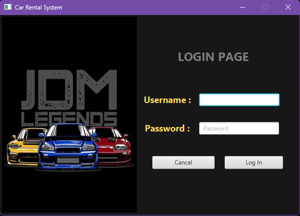
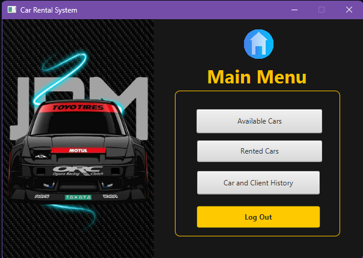
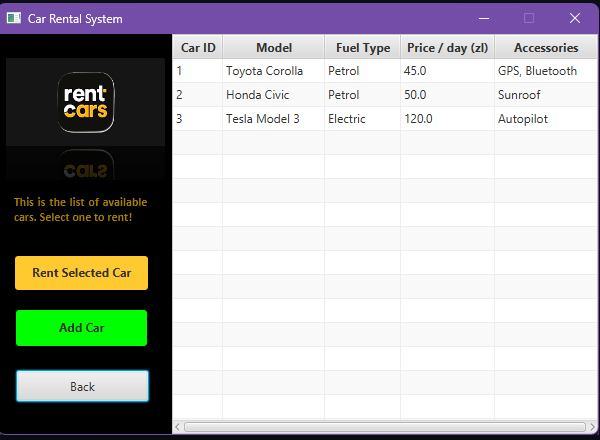

# Car Rental Management System


A robust, enterprise-grade Client-Server application for managing car rentals seamlessly.

## 🚀 Features

This application allows car rental agencies to effectively manage their operations:
- **Available Cars**: Browse a catalog of all cars currently available for rent.
- **Rent Cars**: Rent out cars to clients by registering their name, phone number, and duration.
- **Manage Rentals**: View a live list of currently active rentals, tracking client details and pricing.
- **Returns**: Process car returns securely, which instantly updates vehicle availability.
- **Transaction History**: Track a comprehensive historical log of all past rental transactions.

## 🔑 Login Credentials

When you launch the client application, you will be prompted to log in. Please use the following default administrative credentials:
- **Username**: `admin`
- **Password**: `2580`

*(Database Oracle XE credentials are user `C##car_rental` and password `car123`)*

## 🏛️ Architecture & Project Structure

The project has been engineered following a strict **Client-Server Architecture** utilizing robust separation of concerns and design patterns.

### Architectural Layers
- **Client Layer (JavaFX)**: A rich desktop GUI application built with JavaFX. The client operates exclusively by consuming REST endpoints and contains zero database coupling.
- **Server Layer (Spark Java API)**: A lightweight, high-performance RESTful API backend built with the Spark web framework. It handles all business logic, routing, and validation.
- **Data Access Layer (DAO Pattern)**: The server communicates with an Oracle Database via JDBC using dedicated Data Access Objects (`CarDao`, `RentalDao`, `HistoryDao`). This strictly isolates SQL operations from business logic.
- **Shared Data Transfer Objects (DTO)**: Both client and server exchange data seamlessly using structured DTO classes (`Car`, `Rental`, `HistoryRecord`) serialized over HTTP via Google Gson.

### Folder Structure
```text
CarRentalProject/
├── src/main/java/
│   ├── app/carrental/      # JavaFX UI Controllers and GUI logic (Client Views)
│   ├── client/             # API Client Wrappers connecting UI to Backend
│   ├── dto/                # Data Transfer Objects shared by Client and Server
│   ├── server/             # Spark API Server and core Business Logic Services
│   └── server/dao/         # Data Access Objects encapsulating Oracle JDBC SQL
├── src/main/resources/     # FXML layout files and UI styles
├── Images/                 # Graphical assets and application icons
└── pom.xml                 # Maven configuration and dependencies
```

## 📸 Screenshots

### 1. Main Menu / Available Cars


### 2. Active Rentals


### 3. Rental History


## 🛠️ How to Build and Run

### Prerequisites
- **Java JDK 26** (or JDK 25+ compatible environment)
- **Maven** (A Maven wrapper is included)
- **Oracle Database XE** (Configured locally and running)

### 1. Build the Project
Compile the project and resolve all necessary Maven dependencies from the root directory:
```bash
.\mvnw clean compile
```

### 2. Run the Backend Server
Start the REST API server to listen for client requests. (Make sure you have set `JAVA_HOME` in this terminal window if it's newly opened!):
```bash
.\mvnw exec:java@server
```
The server will start and bind locally to `http://localhost:8080`.

### 3. Run the Client Application
Open a **new terminal window** (leave the server running) and launch the JavaFX Client:
```bash
.\mvnw javafx:run
```
